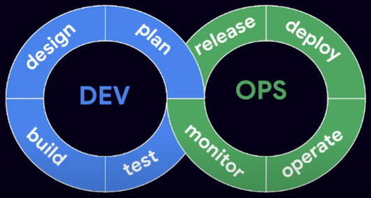

<!-- Add index linking to topics-->
* [What is DevOps?](#what-is-devops)

## What is DevOps?
"Devops is a loose set of **practices,guidelines,** and **culture** designed to break down 
silos in IT development, operations, networking, and security." - The SRE Book

### DevOps Principles:
* **Reduce or eliminate silos**: Breaking down barriers between teams and encouraging collaboration across departments.breaking down barriers between teams and encouraging collaboration across departments
* **Anticipater + normalise accidents**: DevOps encourages teams to focus on learning from incidents and improving processes to prevent similar issues from happening in the future.
* **Changes should be small and frequent**: Small, incremental changes to applications and infrastructure, rather than large, infrequent updates. By making smaller changes, teams can more easily identify and address issues, and can quickly iterate based on feedback. This approach also reduces the risk of introducing errors or conflicts that may arise when large changes are made all at once.
* **Org processes >= Tooling**:  While technology and tools are important in DevOps, this principle emphasizes that organizational processes and culture are equally important. Simply buying the latest tools or implementing new technology without considering how it fits into the overall organizational structure and processes is unlikely to lead to success.
* **Measure!**: Emphasizes the importance of collecting data and metrics to track progress and identify areas for improvement. By measuring the performance of applications, infrastructure, and processes, teams can identify bottlenecks, identify areas for improvement, and make data-driven decisions. Measuring also enables teams to monitor the impact of changes and improvements over time.

### Devops in Practice -Process + Cultural:
* **Learning Culture**: 
* **Streamline approvals**:
* **Shorter lead-times + small commits**:
* **Include customer feedback in design**:

### Devops in Practice - Technical:
* **Version Control**:
* **Deployment Automation, CI/CD**:
* **Infrastructure + config as Code**:
* **Service oriented architecture**:
* **Flexible/cloud infrastructure**:
* **Shifting left on security**:
### Fourkeys:
* **Deploy frequency**: How often do you deploy to production?
* **Lead time for changes**: How long does it take to go from code committed to code successfully running in production?
* **Mean time to recover**: How long does it take to recover from a failure?
* **Change failure rate**: What percentage of changes to production fail?

*To track fourkeys and mesaure teams software delivery performance. Google has a repo called [fourkeys](https://github.com/dora-team/fourkeys.git) uses BigQuery,Pub/Sub and CloudRun*

It is basically breaking down silos and encouraging to deliver software faster in smaller increments. Thereby also reducing the risk of failure.It also includes customer feedback in design.

Teams being able to work independently without getting blocked with the help of mocks or api contracts.

Adopting a cloud to rapidly scale up and down.

Shifiing left on security: Thinking about security from the beginning of the development process or designing the architecture.

<!-- embed as image -->


<!--  -->


# What's different about developing with Kubernetes?
* Some features are built in 
    * Rollouts, Self-healing

* Some features are not built in
    * CI/CD
    * Registry
* Declarative API, apps defined as YAML

* Large ecosystem of tools and products  